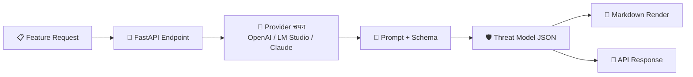

<h1 align="center">🛡️ Feature Threat Model</h1>

<p align="center">
  <a href="https://www.python.org/"></a>
  <a href="https://fastapi.tiangolo.com/"></a>
  <a href="LICENSE"></a>
  <a href="#configuration"></a>
</p>

<p align="center">
  A lightweight API to help create threat models for new product features.
</p>

<p align="center">
  A minimal, opinionated FastAPI service for generating STRIDE-based threat models using real LLM providers.
</p>

---

## ✨ What this does

- Generates **STRIDE threat models** for feature-level changes.
- Supports **OpenAI**, **LM Studio**, and **Anthropic Claude**.
- Returns results as **JSON** or **Markdown**.
- Keeps the architecture small and easy to extend.
- Works well for feature reviews, architecture discussions, and security champion workflows.

---

## 🧠 How it works



1. You send a feature description to the API.
2. The service builds a structured prompt.
3. The selected provider generates a STRIDE-based analysis.
4. The response is validated into a consistent schema.
5. You get either JSON output or a formatted Markdown report.

---

## 🎯 What is STRIDE?

STRIDE is a threat modeling framework developed by Microsoft that categorizes threats into six types:

| Category | Meaning | Example |
|---|---|---|
| **Spoofing** | Impersonating a user or system | Attacker uses stolen credentials to access user data |
| **Tampering** | Modifying data or code without permission | Attacker modifies API requests to escalate privileges |
| **Repudiation** | Denying an action without proof | User claims they didn't perform an action, no audit trail exists |
| **Information Disclosure** | Exposing data to unauthorized parties | API returns more data than intended, exposing PII |
| **Denial of Service** | Making a system unavailable | Attacker floods endpoint, causing service degradation |
| **Elevation of Privilege** | Gaining higher access than intended | User exploits bug to access admin functions |

---

## 💡 Use Cases

### When to Use This Tool
- **Feature design reviews** – Generate threat models during PRD or design doc reviews.
- **Backlog refinement** – Identify security requirements before sprint planning.
- **Architecture discussions** – Surface threats in new integrations or trust boundaries.
- **Security champion workflows** – Enable engineers to self-serve threat models.

### Example Scenarios
- "We're adding file uploads to support tickets – what are the threats?"
- "New webhook integration with third-party service – what could go wrong?"
- "Adding admin dashboard with elevated privileges – what should we consider?"

---

## 🚀 Quick Start

### Prerequisites

- Python 3.11+
- One of the following:
  - OpenAI API key
  - LM Studio running locally
  - Anthropic API key

### Setup

```bash
# 1. Clone the repository
git clone https://github.com/YOUR_USERNAME/feature-threat-model.git
cd feature-threat-model

# 2. Create and activate a virtual environment
python -m venv .venv
source .venv/bin/activate  # On Windows: .venv\Scripts\activate

# 3. Install dependencies
pip install -r requirements.txt

# 4. Copy and configure environment
cp .env.example .env
# Edit .env with your API keys and preferences

# 5. Run the API server
uvicorn app.main:app --reload
```

Open the docs at: [http://127.0.0.1:8000/docs](http://127.0.0.1:8000/docs)

---

## ⚙️ Configuration

Copy `.env.example` to `.env` and update the values.

### Example Configuration

```env
# Application Settings
APP_NAME="Feature Threat Model API"
HOST=0.0.0.0
PORT=8000
RELOAD=true

# Provider Selection
PROVIDER=openai

# OpenAI Settings
OPENAI_API_KEY=sk-...
OPENAI_MODEL=gpt-4o-mini
OPENAI_BASE_URL=https://your-custom-endpoint.com/v1

# LM Studio Settings
LMSTUDIO_BASE_URL=http://127.0.0.1:1234/v1
LMSTUDIO_API_KEY=lm-studio
LMSTUDIO_MODEL=meta-llama-3.1-8b-instruct

# Claude Settings
CLAUDE_API_KEY=your-anthropic-api-key
CLAUDE_MODEL=claude-sonnet-4-20250514

# Threat Model Generation
MAX_RETRIES=2
DEFAULT_SEVERITY=Medium
```

See [`CONFIG.md`](CONFIG.md) for details.

---

## 🧪 API Endpoints

| Endpoint | Method | Description |
|---|---|---|
| `/health` | GET | Health check and current provider |
| `/providers` | GET | Supported and configured providers |
| `/threat-model` | POST | Generate JSON threat model |
| `/threat-model.md` | POST | Generate Markdown threat model |

---

## 📝 Example Requests

### Example 1: File Upload Feature

```json
{
  "feature_name": "User profile picture upload",
  "summary": "Users can upload a profile picture (max 5MB) to their account",
  "actors": ["Authenticated User"],
  "data_elements": ["Profile picture", "User ID", "File metadata"],
  "entry_points": ["REST API /users/{id}/avatar"],
  "trust_boundaries": ["Client to API", "API to object storage"],
  "integrations": ["S3", "Image resizing service"],
  "internet_facing": true,
  "authentication": "JWT bearer token",
  "authorization": "Users can only update their own profile",
  "sensitive_actions": ["File upload", "File deletion"]
}
```

### Example 2: Using test_request.json

```bash
# View the example request
cat test_request.json

# Send it to the API
curl -X POST "http://127.0.0.1:8000/threat-model" \
  -H "Content-Type: application/json" \
  -d @test_request.json

# Save Markdown output
curl -X POST "http://127.0.0.1:8000/threat-model.md" \
  -H "Content-Type: application/json" \
  -d @test_request.json \
  -o output.md
```

### Example 3: Inline Markdown Export

```bash
curl -X POST "http://127.0.0.1:8000/threat-model.md" \
  -H "Content-Type: application/json" \
  -d '{
    "feature_name": "Webhook notifications",
    "summary": "Send order events to customer-configured webhook URLs",
    "actors": ["System", "Customer"],
    "data_elements": ["Order data", "Webhook URL", "Secret token"],
    "entry_points": ["Event processor", "HTTP client"],
    "trust_boundaries": ["Internal service to external URL"],
    "integrations": [],
    "internet_facing": true,
    "authentication": "HMAC signature",
    "authorization": "N/A",
    "sensitive_actions": ["Webhook delivery"]
  }' \
  -o threat-model.md
```

---

## 🧾 Example Outputs

### JSON snippet

```json
{
  "feature_name": "Support ticket attachments",
  "summary": "Customers can upload files when submitting a support ticket.",
  "assets": [
    "Uploaded files",
    "PII in support tickets",
    "Ticket metadata"
  ],
  "threats": [
    {
      "stride": "Tampering",
      "title": "Malicious file upload bypasses validation",
      "severity": "High"
    }
  ]
}
```

### Markdown snippet

```markdown
# Threat model: Support ticket attachments

## Threats
### 1. Malicious file upload bypasses validation
- STRIDE: Tampering
- Severity: High
```

For full examples, see the [`examples/`](examples/) folder, which covers:
- **File uploads** (`example_output.json`, `example_output.md`)
- **Webhooks** (`webhook_output.json`, `webhook_output.md`)
- **Rate limiting** (`ratelimit_output.json`, `ratelimit_output.md`)
- **SSO** (`sso_output.json`, `sso_output.md`)

---

## 🧩 Project Structure

```text
feature-threat-model/
├── app/
│   ├── main.py              # FastAPI routes and endpoints
│   ├── config.py            # Centralized configuration
│   ├── schemas.py           # Pydantic request/response models
│   ├── prompting.py         # System and user prompt templates
│   ├── markdown.py          # Markdown report renderer
│   ├── service.py           # Business logic orchestration
│   └── llm/
│       ├── base.py          # Abstract provider interface
│       ├── factory.py       # Provider selection logic
│       ├── openai_provider.py # OpenAI implementation
│       ├── lmstudio_provider.py # LM Studio implementation
│       └── claude_provider.py # Claude implementation
├── examples/                # Example request and output files
├── requirements.txt         # Python dependencies
├── .env.example             # Configuration template
├── test_request.json        # Example API request
├── README.md                # This file
├── CONFIG.md                # Configuration documentation
├── CONTRIBUTING.md          # Contribution guidelines
├── SECURITY.md              # Security considerations
├── LICENSE                  # MIT license
└── setup.sh                 # One-line setup script
```

---

## ➕ Adding a New Provider

The architecture supports adding new LLM backends easily.

### Step 1: Create Provider Implementation

Create `app/llm/your_provider.py`:

```python
from app.llm.base import LLMProvider
from app.schemas import FeatureInput, ThreatModelResponse


class YourProvider(LLMProvider):
    def __init__(self) -> None:
        # Initialize your client
        pass

    def generate_threat_model(self, feature: FeatureInput) -> ThreatModelResponse:
        # Call your LLM and return ThreatModelResponse
        pass
```

### Step 2: Register in Factory

Update `app/llm/factory.py`:

```python
from app.llm.your_provider import YourProvider

def get_provider() -> LLMProvider:
    provider = settings.provider.lower()
    if provider == "openai":
        return OpenAIProvider()
    if provider == "lmstudio":
        return LMStudioProvider()
    if provider == "claude":
        return ClaudeProvider()
    if provider == "your_provider":  # Add this
        return YourProvider()
    raise ValueError(f"Unsupported provider: {provider}")
```

### Step 3: Add Configuration

Add fields in `app/config.py` and document in `.env.example`.

### Step 4: Test

```bash
PROVIDER=your_provider uvicorn app.main:app --reload
```

---

## 🏗️ Design Notes

### Philosophy

- **Feature-focused**: Assesses net-new features, not entire systems
- **Actionable output**: Concise threats with mitigations, not generic advice
- **Explicit uncertainty**: Captures assumptions and open questions
- **Provider-flexible**: Swap backends without code changes

### Why This Approach?

Traditional threat modeling tools are often:

- Too heavy for quick feature reviews
- Focused on diagramming over actionable output
- Difficult to integrate into development workflows

This tool aims to be:

- **Fast**: Get a threat model in seconds
- **Lightweight**: Minimal dependencies, easy to deploy
- **Integratable**: JSON output for automation, Markdown for humans

### Output Schema

All threat models follow a consistent structure:

- `feature_name`, `summary` – Feature description
- `assets` – Identified data/assets at risk
- `trust_boundaries` – Security boundaries identified
- `threats[]` – STRIDE-categorized threats with:
  - `stride`, `title`, `scenario`, `impact`
  - `likelihood`, `severity`
  - `mitigations[]`, `assumptions[]`
- `abuse_cases[]` – Specific attack scenarios
- `security_questions[]` – Open questions for the team

---

## 🔐 Security Considerations

### Secrets Management
- **Never commit `.env`** – It's ignored by `.gitignore`.
- **Use environment variables** in production deployments.
- **Rotate API keys** regularly.

### LLM Output
- **Treat as untrusted** – Always review and validate.
- **Human in the loop** – Don't auto-apply mitigations.
- **Context matters** – Models may miss domain-specific threats.

### Access Control
- **Internal use** – Consider adding auth (API key, SSO).
- **Network isolation** – Run behind firewall or VPC.
- **Rate limiting** – Prevent abuse in shared environments.

### Provider-Specific Notes
- **OpenAI**: Structured output is more reliable but still review.
- **LM Studio**: Local models may be less reliable; use retries.
- **Claude**: Strong reasoning, handles complex schema validation via retries.

---

## 🤝 Contributing

Contributions are welcome! See [`CONTRIBUTING.md`](CONTRIBUTING.md) for details.

### Good First Contributions
- Add new LLM providers (Anthropic, Ollama, etc.)
- Improve prompt templates for better output
- Add integrations (Jira, Linear, GitHub Issues)
- Create UI frontends (Streamlit, HTML form)
- Enhance documentation and examples

### How to Contribute
1. Fork the repo
2. Create a feature branch (`git checkout -b feat/your-feature`)
3. Make your changes and test locally
4. Open a pull request describing the change

---

## 📄 License

MIT License — see [`LICENSE`](LICENSE) for details.

---

## 🙌 Acknowledgments

- Inspired by [STRIDE GPT](https://github.com/mrwadams/stride-gpt).
- Built with [FastAPI](https://fastapi.tiangolo.com/) and [Pydantic](https://docs.pydantic.dev/).
- Designed to be small, practical, and easy to extend.

---

## 💬 Support

- Open an issue for bugs or feature requests
- Contact maintainers for security-related concerns

---

<p align="center">
  <strong>Happy threat modeling! 🛡️</strong>
</p>